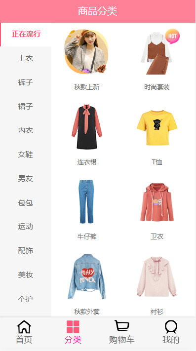
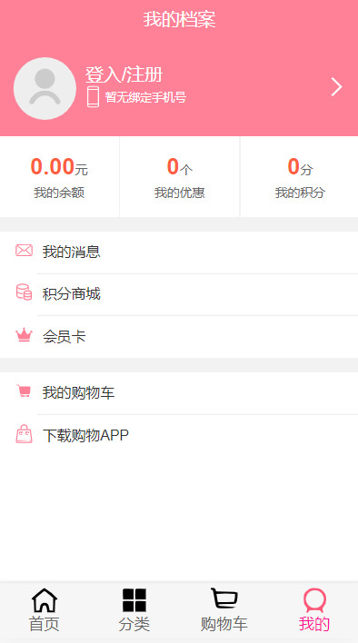
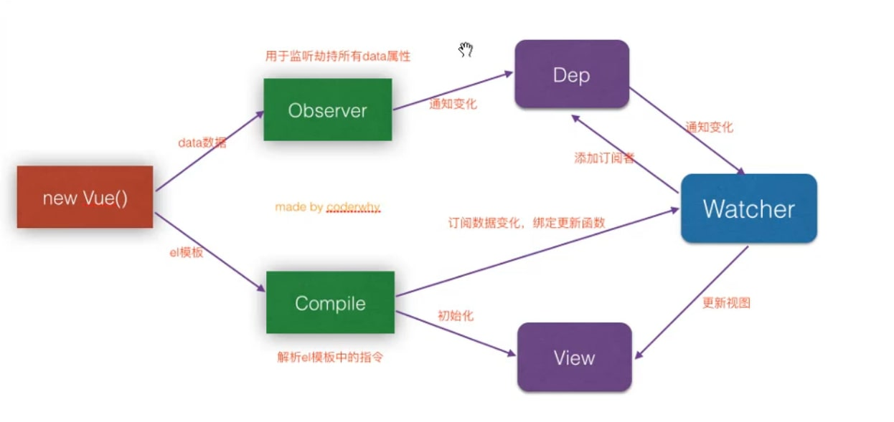
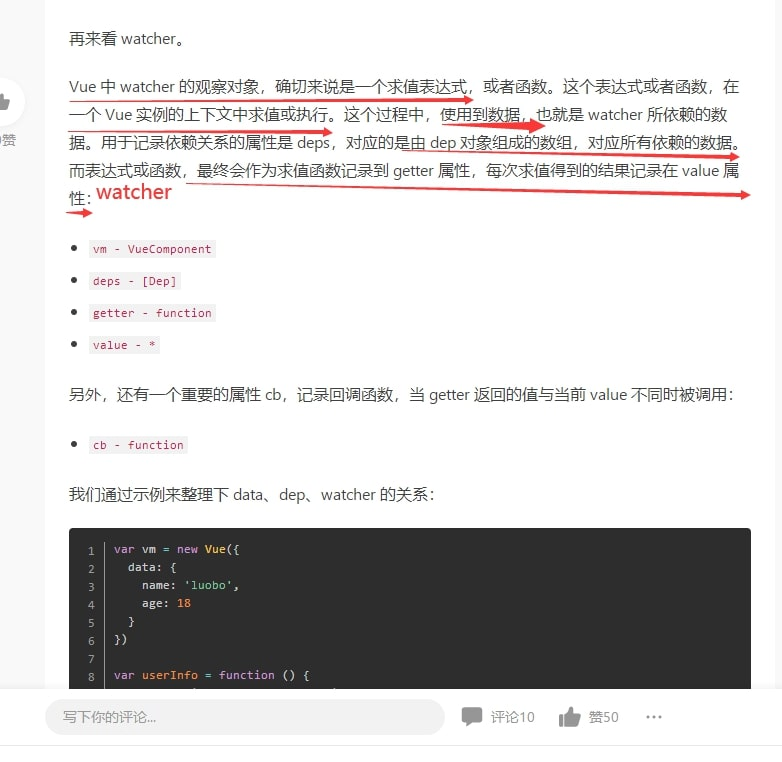
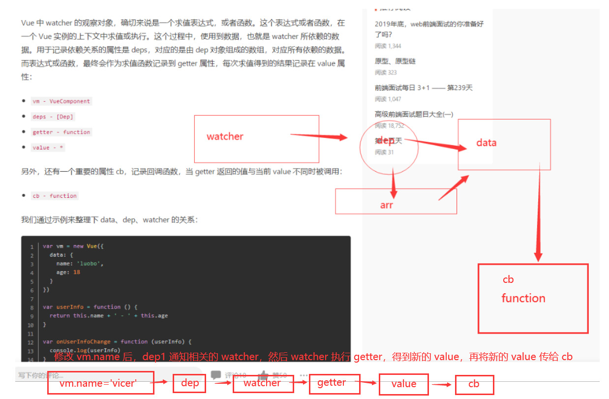
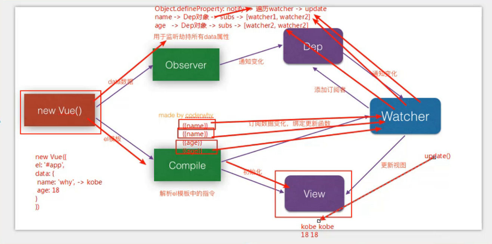

# 项目介绍

一个蘑菇街电商设计页面，使用了vue路由，vuex，轮播图，购物车计算，内容联动，封装思想，插件封装，事件总线，防抖函数，接口使用等技术，vue的技能点基本全部运用，同时使用第三方插件betterScroll来提高滚动流畅度，并解决了使用betterScroll的相关问题

### 项目截图






## 项目一些思路

### 一. 项目基本设置

#### 1.1. 目录结构

- network
- components -> common/content
- pages -> 路由分层
- common 
- assets
- router
- store


#### 1.2. 设置CSS初始化和全局样式

- initialize.css
- base.css


#### 1.3. tabbar的封装

- 封装HYTabbar
- 封装HYTabbarItem
- 响应点击切换的设计
- 封装完成后，使用时对HYTabbar重新包装


#### 1.4. axios的封装

- 创建axios实例
- 拦截响应，返回.data数据
- 根据传入的options发送请求，并且调用对应resolve和reject


### 二. 首先开发

#### 2.1. navbar的封装和使用

- 封装navbar包含三个插槽：left、center、right
- 设置navbar相关的样式
- 使用navbar实现首页的导航栏


#### 2.2. 请求首页数据

- 封装请求首页更多数据
- 将banner数据放在banners变量中
- 将recommend数据放在recommends变量中


#### 2.3. 根据Swiper封装HomeSwiper

- 使用Swiper和SwiperItem
- 传入banners进行展示


#### 2.4. 封装FeatureView

- 传入recommends数据，进行展示


#### 2.5. 封装RecommendView

- 展示一张图片即可


#### 2.6. 封装tabControl

- 基本结构的封装
- 监听点击


#### 2.7. 请求和保存商品数据

- 定义goodsList变量，用于存储请求到的商品数据
- 根据type和page请求商品数据
- 将商品数据保存起来


#### 2.8. 封装GoodsList和GoodsListItem

- 展示商品列表，封装GoodsList
- 列表中每一个商品，封装GoodsListItem
- 注意CSS属性的设置即可


#### 2.9. 滚动的封装Scroll

- 学习BetterScroll的使用
- 安装better-scroll
- 封装一个独立的组件，用于作为滚动组件：Scroll
- 组件内代码的封装：
  - 1.创建BetterScroll对象，并且传入DOM和选项（probeType、click、pullUpLoad）
  - 2.监听scroll事件，该事件会返回一个position
  - 3.监听pullingUp事件，监听到该事件进行上拉加载更多
  - 4.封装刷新的方法：this.scroll.refresh()
  - 5.封装滚动的方法：this.scroll.scrollTo(x, y, time)
  - 6.封装完成刷新的方法：this.scroll.finishedPullUp


#### 2.10. 上拉加载更多

- 通过Scroll监听上拉加载更多。
- 在Home中加载更多的数据。
- 请求数据完成后，调动finishedPullUp


#### 2.11. 返回顶部

- 封装BackTop组件
- 定义一个常量，用于决定在什么数值下显示BackTop组件
- 监听滚动，决定BackTop的显示和隐藏
- 监听BackTop的点击，点击时，调用scrollTo返回顶部


#### 2.12. tabControl的停留

- 重新添加一个tabControl组件（需要设置定位，否则会被盖住）
- 在updated钩子中获取tabControl的offsetTop
- 判断是否滚动超过了offsetTop来决定是否显示新添加的tabControl

## 项目笔记

### 创建项目及git合并

1. 创建远程仓库，无需选配置README文件，开源协议选MIT。直接克隆下来
2. 然后再在webstorm中创建项目，项目会提示文件名已存在，选择merge合并即可
3. 这样就免去了还要链接远程仓库的麻烦

如果你已经创建好了项目想链接远程仓库，执行以下指令
1. 链接远程仓库
		git remote add origin 仓库地址
2. 把当前分支push到远程分支
		git push -u origin master

### css 

css初始化可以直接引用initialize.css。在github上

### .editorconfig文件

这个文件在cli3中被移除了。但这个统一标准还是很重要的，如果作为项目组长，一定要把这个copy过来使用

### axios封装

处理封装一个统一管理文件之外。还要再封装一个单独面向文件。如home.vue封装home.js网络请求文件，request->home.js->home.vue  
可以降低模块耦合度，便于管理。现在项目小，等以后大项目便会了解这么做的好处

### 何时使用路由和插槽

页面结构有变化用路由，只变数据不用路由；组件内结构有变化用插槽，只变内容则不用

### 声明周期函数封装

我们一般不在声明周期函数内直接处理。
而是给它封装在methods中

### betterScroll第三方插件的使用

[BScroll官网](https://better-scroll.github.io/docs/zh-CN/)

注意事项：  
1. 使用声明周期函数调用BScroll时要在DOM创建后使用，如使用module()生命周期函数
2. wrapper中只能包含一个元素content。然后挂载wrapper。如果想添加内容在content中添加
3. 父视窗为100vh，子视窗设为position:absolute;top: 44px;bottom: 49px;overflow: hidden;  
   top和bottom是上下边框留的边距。不要可以删除，其他别乱改

**滚动侦测**：  
* 当 probeType 为 1 的时候，会非实时（屏幕滑动超过一定时间后）派发scroll 事件；  
* 当 probeType 为 2 的时候，会侦测当前滚动距离，但滚动惯性不侦测；  
* 当 probeType 为 3 的时候，滚动和惯性全部侦测

	  let bscroll = new BScroll(document.querySelector('.wrapper'),{
		//配置参数
        probeType:2
      });
	  //绑定事件
      bscroll.on('scroll',position =>{
        console.log(position);
      })
	  
**上拉加载**：  
1. 配置参数为
		pullUpLoad:true
2. 绑定事件pullingUp
3. 加载完成后  标识上拉加载结束finishPullUp()
		bscroll.on('pullingUp',() =>{
			console.log('上拉加载');
			//发送网络请求，请求页面数据
			//数据展示完成
			setTimeout(()=>{
				//标识上拉加载结束
				bscroll.finishPullUp()
				//刷新组件
				bscroll.refresh();
        },2000)
		
**click参数**
		
在BScroll中，点击事件默认会被阻止。（&lt;button&gt;除外）
需要设为true才支持点击事件

### BScroll插件封装

不管axios还是BScroll，只要是第三方插件，一般都会面临不会维护或bug等风险。到时候出问题每个引入页面都要修改  

我们只要做一个封装，然后再在组件中导入使用。到时只需修改封装组件即可

```html
<template>
  <div class="wrapper" ref="wrapper">
    <div class="content">
      <slot></slot>
    </div>
  </div>
</template>

<script>
  import BScroll from 'better-scroll'
  export default {
    name: "Scroll",
    props:{
      probeType: {
        type:Number,
        default:0
      }
    },
    data(){
      return {
        bscroll:null
      }
    },
    mounted() {
      this.bscroll = new BScroll(this.$refs.wrapper,{
        probeType:this.probeType,
      });
      this.bscroll.on('scroll',position =>{
        this.$emit('scroll',position)
      });
    },
    methods:{
		//传入默认time=500
      scrollTo(x,y,time=500){
        this.bscroll.scrollTo(x,y,time);
      }
    }
  }
</script>

```


使用方法：
1. 注册组件
2. 把要滚动的内容嵌套在组件中即可
3. 通过父传子把配置参数传递，在emit发射到父组件中使用


### BScroll的高度问题解决

#### bug1

在SCroll中，高度计算出来之前，图片还有加载完，会导致即使图片加载出来了无法向下滚动的问题

解决办法，通过@load监听每个图片的加载，每加载完成一个图片刷新重新计算高度

1. 在vue中通过原型挂载$bus并new Vue。通过vue的事件总线来发射到父组件中
		Vue.prototype.$bus = new Vue()
2. 在图片监听事件中发射事件总线
		this.$bus.$emit('aaa')
3. 在父组件生命周期函数中监听事件总线，进行刷新
		this.$bus.$on('aaa',()=>{
			 this.$refs.scroll.refresh();
		})

#### bug2

当我们在父组件刷新BScroll时，提醒refresh没有找到的问题

解决办法：

	  //一、判断是否获取到bscroll再执行
	  refresh(){
        this.bscroll && this.bscroll.refresh()
      }
	 //二、在mounted生命周期函数中使用，而不是created中

### 防抖debounce

在实际开发中我们可能每当用户输入一个字符就请求一次数据，这时一个很大的性能浪费，
可以当用户在300ms内持续输入时，取消数据请求，过了时间后再发送数据，缓解服务器压力。
这种操作就叫做防抖处理

在BScroll中为了解决高度问题，进行监听每个图片加载而频繁刷新，会浪费性能
我们也可以进行防抖处理。

```javascript
  debounce(fun,delay){
	let timer = null;
	return function (...args) {
	  if(timer) clearTimeout(timer);
	  timer = setTimeout(()=>{
		fun.apply(this,args)
	  },delay)
	}
  }
```
防抖函数讲解：
知识点：seTimeout会返回一个ID池，通过clearTimeout内传入ID值来取消timeout
1. 第一次执行，没有timer跳过，直接执行setTimeout
2. 第二次执行，拿到了setTimeout第一次返回的timer，在delay时间内被清空。然后继续执行setTimeout
3. 第三十次，重复到第29次timer清空，执行setTimeout。这时没有第31次了，直接执行seTimeout内的函数
4. 通过apply指向当前function，是因为fun是形参，不是属于Vue实例的方法，要用Vue实例调用就得改变this指向


使用方法  
1. 传入函数和延时const backFun = debounce(fun,delay)。  //这里fun不要加()
2. 调用返回函数backFun()  
3. args是如果在调用backFun()时，里面可以传参数，(...args)时es6数组解构，可以传多个参数

### tab control 的吸顶效果

#### 一、高度获取
在vue中无法直接获取组件在实例中的距离顶部的高度

可以通过$el，再获取offsetTop

	this.$refs.tabControl.$el.offsetTop

但在图片为加载完成时获取的高度不准确，所以我们判断影响高度的是轮播图的高度。  
获取img的加载。我们只需获取一次即可。不需要多次获取，所以无需用到防抖函数  

		//这里设置isLoad=false
		  imgLoad(){
			if(!this.isLoad){
			  this.$emit('swiperImgLoad')
			  this.isLoad = true;
			}
		  }
		  
#### 二、组件替换

方案一。  
一开始思路是  记录高度值，在高度到达position时设置fixed，
但BScroll的translate与fixed效果冲突

方案二。  
移形换影，复制当前组件，脱离BScroll，使组件定位脱离文档流，
当到达高度，使用v-show显示复制的组件

bug解决。因复制组件所以显示被选中不一致
通过ref 1和2  获取组件，把当前index赋值（ref1和ref2）的currentIndex即可。  
index相等时class效果生效


### 切换回到原处

在app中，使用keep-alive有时无法回到原处。保险起见，使用activated和deactivated
在离开时记录scroll.y位置。回到组件使用scrollTo()回到原位置

### 详情页

#### 顶部的NabBar进行组件复用  
获取公共组件进行插槽复用
#### 创建路由，利用路由传递id。再用id请求网络，最后做轮播图
然后在goodsItem页面监听点击发送路由和params的id，请求后在Detail页面再通过路由获取到id。  
利用id来发送网络请求，并单独封装一个网络请求返回数据。利用返回数据做轮播图
#### 问题解决
在详情页请求id时，因为App主页做过keep-alive，所以我们请求到的都是一个id。
解决办法就是给 keep-alive设置exclude="Detail"属性，把Detail排除在外。  
这里也可以用activated生命周期函数

### 数据整合

当我们获取接口时，需要同时获取多个接口的数据，可以定义一个类。  
这样获取数据时只需把类传递过去即可，不用传递多个接口

	class Person(name,age){
		this.name = name,
		age = age
	}
	//我们想要保存一个数据，直接new一个对象传过去
	const g = new Person('vicer',18);
	//使用时直接获取即可
	g.name;
	g.age;
	
	在vue中导入用法，其他用法不变
	export class Goods{
		constructor(a,b){
			this.a=a;
			this.b=a;
		}
	}
	
### 判断数据是否存在

	Object.keys(obj).length !== 0
解释：
Object.keys用来遍历对象的属性，参数是一个对象，并返回数组

在项目中前面可以加上v-if ，这样就可以做到有数据时显示


### 判断图片高度

之前使用防抖函数，判断img加载获取高度。
还可以监听img的list数量。当数量等于接口的length时，刷新页面重新计算scroll高度。

#### 一、通过img数量判断高度

1. 使用watch监听数据的变化
2. 在wathc函数内获取图片length保存为current。
3. 再定义变量count保存图片加载次数，每次加载+1
4. 当count===current时emit发送数据，刷新页面

这个方法适用于简单获取图片次数来计算高度
还有其他操作的话建议使用防抖函数。

#### 二、使用防抖函数：

把debouce返回的函数用data的属性来保存，不要用const或let，  

	this.backFun = debounce(fun,delay);  

//这里要用data保存是因为，我们使用防抖函数时**把使用方法封装到了mixin中**，再通过methods使用，
，通过methods保存的变量函数使用完会被销毁，每次都要重新创建。所以要在mixin使用data保存。

	methods:{
		imgLoad(){
			this.backFun()
		}
	}


### 转换时间戳  

在后台给出的一般都是时间戳。
我们需要进行时间格式化  

这里我们有两种方法。

#### 引用ES6代码转换

	export function formatDate(date, fmt) {
	  if (/(y+)/.test(fmt)) {
		fmt = fmt.replace(RegExp.$1, (date.getFullYear() + '').substr(4 - RegExp.$1.length));
	  }
	  let o = {
		'M+': date.getMonth() + 1,
		'd+': date.getDate(),
		'h+': date.getHours(),
		'm+': date.getMinutes(),
		's+': date.getSeconds()
	  };
	  for (let k in o) {
		if (new RegExp(`(${k})`).test(fmt)) {
		  let str = o[k] + '';
		  fmt = fmt.replace(RegExp.$1, (RegExp.$1.length === 1) ? str : padLeftZero(str));
		}
	  }
	  return fmt;
	};

	function padLeftZero (str) {
	  return ('00' + str).substr(str.length);
	};

将代码引入，将时间戳*1000，并转换成Date对象

	filters:{
	  showDate(value){
          let date = new Date(value*1000) ;
          return formatDate(date,'yyyy-MM-dd');
        }
	}
在实例中使用过滤器即可


#### 使用vue插件moment转换格式

安装  

	npm install moment --save
 
引入  

	import moment from 'moment'  

使用过滤器定义函数

	filters:{
	  formatDate(time) {
	    const date = new Date(time);
	    return moment(time).format('YYYY-MM-DD hh:mm:ss');
	  }
	}
我们需要获取哪个就把格式写上，无需则省略

	格式：年-月-日 时:分:秒  
	yyyy-MM-dd hh:mm:ss  

### 同时使用goodsList的问题

使用时我们做了加载图片刷新页面。但我们在detail页面加载的时候home页面也在刷新

**解决办法一**：  判断路由

	if(this.$rout.path.indexOf('/home')){
		this.$bus.$emit('homeItemImgLod');
	}else if(this.$rout.path.indexOf('/detail')){
		this.$bus.$emit('detailItemImgLod');
	}

**解决办法二**： 使用混入，导入防抖函数

这里不用继承，而是用混入。继承是继承原来的变量，混入是返回一个新的变量

1. 在使用防抖函数中的回调方法抽取出来，赋值给一个data属性。
2. 把data和使用防抖回调一起导入进mixin中，然后再导入mixin
		data(){
		  return{imgLoadListener:null}
		},
		mounted(){
		  let refresh = debounce(this.$refs.scroll.refresh,50);
		  this.imgLoadListener = ()=> {refresh()};
		  this.$bus.$on('itemImgLoad', this.imgLoadListener);
		}
		
### 内容标题联动效果

需求：点击标题时滚动到指定内容

问题点，在哪里获取正确的offsetTop
1. created不行，没有获取到元素
2. mounted也不行，数据还没获取到
3. 数据回调也不行，DOM还没渲染完
4. $nextTick也不行，图片高度没有计算在内
5. 在图片加载完成后获取，才能获取正确高度

做法，使用ref获取每个组件的高度，然后保存在数组。利用点击事件切换index来切换高度

需求：滚动内容切换标题样式。

做法，判断高度区间来切换数组标题的下标  
```js
	for(let i=0;i<length;i++){
	  if( this.currentIndex !== i && ((i<length-1 && positionY > this.themeTopYs[i] && positionY < this.themeTopYs[i+1]) ||
		( i === length-1 && positionY >= this.themeTopYs[i])) ){}
	}
```
上面的做法太繁琐，让我们hack一点。

在数组末尾push中数组最大值
  
     this.themeTopYs.push(Number.MAX_VALUE);

只需判断区间内的高度即可，如i>0 && i<100。因为添加了最大数，遍历时记得length-1
```js
	for(let i=0;i<length-1;i++){
	  if(this.currentIndex !== i && (positionY >= this.themeTopYs[i] && positionY < this.themeTopYs[i+1])){
		this.currentIndex =i;
		this.$refs.navBar.currentIndex = this.currentIndex;
	  }
	}
```

### 返回顶部组件封装

把methods，data，components一起封装进mixin，然后直接导入使用。
记得需要调用封装好的backTopFun函数传入position。

### 加入购物车

把需要展示的数据列出，并组成对象。
使用vuex，对比购物车cartList中商品的id和传入的新商品id，有的话把商品的count+=1，
没有的话直接设置为1 ，push进cartList中

for循环方法  

      // let oldGoods = null;
      // for(let item in state.cartList){
      //   if(item.iid = payload.idd){
      //     oldGoods = item
      //   }
      // }

利用find数组方法，代替for。

	  //如果函数内判断为true，则返回item。
      let oldGoods =  state.cartList.find( item => payload.iid === item.iid);
		
### 购物车选中按钮点击

购物车商品应封装一个模块，点击按钮也进行一个封装。
默认在加入购物车时为选中，所以在vuex中push时把checked设为true

选中按钮动态绑定class，并通过props传入checked的布尔值。
监听组件点击使用click.native，点击时进行布尔取反即可

### 购物车价格及数量计算

 获取vuex中cartList，通过filter进行判断，item.checked为true则返回item。
然后再通过链式编程，继续把item通过reduce进行累加，价格*数量+之前的返回值。
最后还可以确定小数点后两位。
```js
  totalPrice(){
	return this.$store.state.cartList.filter( item =>{
	  return item.checked;
	}).reduce( (preValue,item) =>{
	  return preValue+item.price*item.count;
	},0).toFixed(2)
  }
```
选中的数量就非常简单了，在filter后面加个length即可


### 监听购物车全选按钮

在bottomBar中的按钮，使用父传子，把isChecked的布尔值传过去即可。

使用计算属性计算

方法1
```js
//every无法判断空数组情况，所以要先判断length
if(this.cartList.length === 0) return false;
return this.cartList.every( item =>{
  return item.checked;
})
```

方法2  
```js
//当没有商品时length返回的是0，需要返回布尔值返回0会报错，所以我们这里用双！！，进来类型转换
return !!(this.cartList.length && this.cartList.every( item => item.checked ))
```

###  点击购物车全选按钮

监听点击，如果按钮为全部选中状态，点击则全部取消。
如果为部分选中，点击则全部选中

	//由于之前已经计算过全选状态，直接if判断即可
	if(this.isSelectAll){
		this.cartList.forEach(item => item.checked = false)
	}else{
		this.cartList.forEach(item => item.checked = true)
	}

### 购物车Toast

Toast：商品添加成功弹窗

toast不要再商品push后面直接显示，而是要监听数据是否有添加。  
在actions中，使用new promise的回调，把添加成功信息回调出来，再用then做显示操作


### Toast封装成插件

在vue中如果我们导入组件还需要再特定位置引用和设置参数等，我们可以把一个组件封装成一个插件，
直接一行代码就可以使用封装的组件
```js
//3.导入Toast组件
import Toast from "./Toast";
//1.创建index文件，封装对象并导出
const obj = {};
//2.当使用Vue.use时自动执行install，并且会把Vue传递进去
obj.install = function (Vue) {
  //4.创建组件构造器
  const toastConstructor = Vue.extend(Toast);
  //5.通过new的方式，根据组件构造器可以创建出来一个组件对象
  const toast = new toastConstructor();
  //6.将组件对象，手动挂载到某一个元素上
  toast.$mount(document.createElement('div'));
  //7.这里toast.$el对应的就是div
  document.body.appendChild(toast.$el);
  //8.把toast挂载到vue原型上，通过vue的$toast方法来调用toast对象
  Vue.prototype.$toast = toast;
};

export default obj
```

9. 在main.js中导入，并使用vue进行安装
		import toast from './toast'
		Vue.use(toast)
10. 通过this.$toast来调用对象(组件)toast的方法把~
		this.$toast.show();


### 解决手机点击延迟300毫秒

步骤：
1. 安装fastclick插件
		npm install fastclick --save
2. 导入
		import FastClick from 'fastclick'
3. 调用attach函数
		FastClick.attach(document.body);

如果使用fastclick报错，是因为处理函数touchstart默认的passive: true，忽略掉preventDefault() 就可以了。  
也可以为容器设置css属性touch-action，去除滑动时默认现象产生，但不影响事件触发
			
	body{
		touch-action: none;
	}
	
### 图片懒加载

Vue-Lazyload

1. 安装
npm install vue-lazyload --save
2. 导入
		import VueLazyLoad from 'vue-lazyload'
		//里面的参数可传可不传
		Vue.use(VueLazyLoad,{
			//占位图
			loading:require('./img/placeholder.png')
		})

3. 使用：把:scr  换成v-lazy

### px2vw-css单位转化插件

移动端适配方案postcss-px-to-viewport

一般设计稿都是按照iPhone6(750*1334)来设计的

所以视窗的宽高一般是375*667

1. 安装
npm install postcss-px-to-viewport --save-dev

2. 配置文件  

配置在根目录下postcss.config.js
```js
module.exports = {
  plugins: {
    autoprefixer: {},
    "postcss-px-to-viewport": {
      viewportWidth: 375,  // 视窗的宽度，对应的是我们设计稿的宽度.
      viewportHeight: 667, // 视窗的高度，对应的是我们设计稿的高度.(也可以不配置)
      unitPrecision: 5, // 指定`px`转换为视窗单位值的小数位数（很多时候无法整除）
      viewportUnit: 'vw', // 指定需要转换成的视窗单位，建议使用vw
      selectorBlackList: ['ignore', 'tab-bar', 'tab-bar-item','button-bar','bottom-bar'], // 指定不需要转换的类,后面再讲.
      minPixelValue: 1, // 小于或等于`1px`不转换为视窗单位.
      mediaQuery: false, // 允许在媒体查询中转换`px`
      exclude:[/^TabBar/,/^tab-control/,/^TabControl/]  //排除文件的转换，数组中放正则表达式
    },
  }
}
```

### 在window下部署nginx

服务器->操作系统->window(.net)/Linux->tomcat/nginx(软件/反向代理)

一：将自己的电脑作为服务器 -> window ->nginx  
1. 下载Stable version稳定的window版本  
2. 解压到英文目录下

二、配置文件

*  粗暴：可以直接把dist内的文件复制到html文件夹中。  
*  优雅：在conf文件夹中找到nginx.conf配置文件，把locations的root html注释并改成dist，更新配置(无需停止再重启)
	    location / {
				#root   html;
				root   dist;
				index  index.html index.htm;
			}
			
三、nginx命令

*注意：不要直接双击启动* 

启动命令  ```start nginx```  
更新配置  ```nginx -s reload```  
退出命令  ```nginx -s quit```  
强行停止  ```nginx -s stop```   
	
四、启动服务查看网页
	
在网址输入，无需输入端口，默认80

	localhost


### 远程服务器

买服务器之后安装如下软件

secureCRT  在命令行下部署
winsco	   使用文件方式部署

Xshell  B站弹幕推荐
FinalShell B站弹幕推荐

### 面试题

* 如何理解生命周期
* 如何进行非父子组件通信

	

### Vue响应式原理

不要认为数据发生改变，页面跟着更新是理所当然的







```js
	const obj = {
		name:'vicer',
		age:18
	}
	
	//在对象中，无法直接监听对象的改变，
	//1.通过defineProperty来监听对象属性的改变
	//2.当数据发生改变，vue要通知哪些人，界面发生刷新
	Object.keys(obj).forEach(key =>{
		//遍历下标获取value
		let value = obj[key]
		Object.defineProperty(obj,key,{
			set(newValue){
				//当更新数据自动执行set
				//我们如何在监听到数据发生改变，要通知哪些人呢？？
				//谁在用通知谁。通过解析html代码，获取哪些人在用属性，
				console.log('设置了'+key+'的数据');
				//通知数据发生改变。
				dep.notify();
				value = newValue
			},
			get(){
				//当获取函数自定执行set
				//当获取的时候会自动调用get，get便会记录谁调用了。
				console.log('获取了'+key+'的数组');
				return value;
			}
		})
	})  
	//发布订阅者模式
	
	//发布者
	class Dep{
		constructor(){
			//记录谁订阅了信息更新
			this.subs = []
		}
		
		addSub(wacther){
			this.subs.push(wacther)
		}
		//发送通知
		notify(){
			this.subs.forEach(item =>{
				//当发送通知时更新数据
				item.updata();
			})
		}
	}
	
	//订阅者
	class Wacther{
		constructor(name){
			this.name = name
		}
		updata(){
			console.log(this.name + '更新了数据');
		}
	}

	const dep = new Dep();
	//多个订阅者
	const w1 = new Wacther('张三')
	dep.addSub(w1);
	const w2 = new Wacther('李四')
	dep.addSub(w2);
	const w3 = new Wacther('王五')
	dep.addSub(w3);

```


s
图片讲解：
1. 从new Vue() => Observe   这里Observe其实就是defineProperty，来监听data改变
2. Observe => Dep	一个属性对应一个Dep。如name对应一个，age对应一个。然后把订阅者添加到subs里。
3. 从new Vue() => Complie => Watcher		这里通过{{}}语法解析模板，并通过Watcher订阅数据变化，绑定更新函数到Dep中
4. Dep => Watcher =>View	Dep通知订阅者Wathcer，Wathcer再updata更新View，就完成了一整套的响应式

### 原项目优化

#### 在切换tab-control标签时回到顶部

在接收发射事件内，使用scrollTo回到tab-control的高度即可

#### 优化接口不稳定问题

配置两个接口，使用axios的promise的catch回调函数，调用接口二并传入参数
